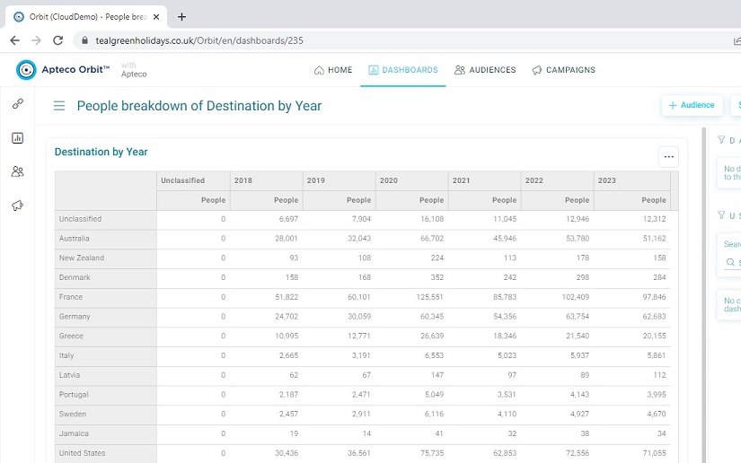

# Aggregation Result Format

The Teal Green Holidays API returns data as JSON objects.  The example result from one of the aggregation endpoints is provided in [/data/cube-results.json](../data/cube-results.json).

## The Teal Green Holidays dataset

The example result shows information about the number of People that have made Bookings to particular destination countries over time.  The relationship between the Person entity and Booking entity is one-to-many, where each person could have zero or more associated bookings.

There are multiple attributes held in the data for each person and booking entity and the example results show an aggregation for Booking Destination and Booking Date (grouped into years).  The numbers returned are counts of people that have one or more bookings that fall into each category (rather than number of bookings for each category).  For example, the following image shows a graphical representation of the same data.  The table shows that there are 28,001 people that have had one or more bookings to Australia in 2018.



The data in [/data/cube-results.json](../data/cube-results.json) is structured in the following way:

| Property name                                                                                     | Description                                                           |
| ---                                                                                               | ----                                                                  |
| title<br>notes<br>ranSuccessfully<br>systemName<br>systemLoadDate<br>userName<br>queryDescription | Metadata about the results - often unpopulated                        |
| dimensionResults[]                                                                                | An array of dimensions (in this case destination and booking year)    |
| dimensionResults[].id                                                                             | The id of the dimension                                               |
| dimensionResults[].headerCodes                                                                    | A tab delimited set of codes for dimension categories                 |
| dimensionResults[].headerDescriptions                                                             | A tab delimited set of descriptions for dimension categories          |
| measureResults[]                                                                                  | An array of aggregation results (in this case the count of People)    |
| dimensionResults[].id                                                                             | The id of the measure                                                 |
| dimensionResults[].rows                                                                           | An array of tab delimited rows of numeric data (see below)            |
| dimensionResults[].cells                                                                          | An alternative way of showing numeric data (not used in this example) |
| cube                                                                                              | The specification of the aggregation request (optional)               |
| counts[]                                                                                          | An array of the total number of entities being analysed               |
| counts[].tableName                                                                                | The name of the entity (table) for this count                         |
| counts[].countValue                                                                               | The total number of entites being analysed                            |

For example, a simplifed version of the results is as follows, with a small dummy dataset and skipping some unnecessary properties:

```
{
  "dimensionResults": [
    {
      "id": "dimension-1",
      "headerCodes": " !\t1\t2\t3\tiTOTAL",
      "headerDescriptions": "Unclassified\tCategory 1\tCategory 2\tCategory 3\tiTOTAL"
    },
    {
      "id": "dimension-2",
      "headerCodes": "!\tA\tB\tC\tD\tiTOTAL",
      "headerDescriptions": "Unclassified\tCategory A\tCategory B\tCategory C\tCategory D\tiTOTAL"
    }
  ],
  "measureResults": [
    {
      "id": "measure-1",
      "rows": [
        "10\t20\t30\t40\t100",
        "11\t21\t31\t41\t104",
        "12\t22\t32\t42\t108",
        "13\t23\t33\t43\t112",
        "14\t24\t34\t44\t116",
        "60\t110\t160\t210\t540",
      ],
    }
  ],
  "counts": [
    {
      "tableName": "People",
      "countValue": 540
    }
  ]
}
```

The data in the `measureResults[0].rows` array is structured so that each row has tab-delimited values that correspond to each category in the first dimension, and each row itself corresponds to each category in the second dimension.  For both dimensions, the first category (with a description of "Unclassified") is for all data that doesn't fall into any other category and the last category (with a description of "iTOTAL") is the total across that dimension. Therefore we can read the following information from the data:

- The number of people that correspond to `Category 1` in dimension 1 **and** `Category B` in dimension 2 is *22*
- The total number of people that correspond to `Category 1` of dimension 1 overall is *110*
- The total number of people that correspond to `Category C` of dimension 2 overall is *112*
- The total number of people overall is the total cell in the total row or column (i.e. value at the bottom-right of the data set): *540*

## API Documentation

The API is documented at https://www.tealgreenholidays.co.uk/OrbitAPI/swagger/ui.  The API provides many endpoints and the discussion of all of them is beyond the scope of this exercise, but the endpoint that returns aggregated results such as the example one is https://www.tealgreenholidays.co.uk/OrbitAPI/swagger/ui/index.html#/Cubes/Cubes_CalculateCubeSynchronously.

The request that was used against the above endpoint to generate the example results can be found in [/data/cube-request.json](../data/cube-request.json).  For details of how to connect to the API to generate the results with this request, see [/docs/connecting-to-api.md](docs/connecting-to-api.md).
