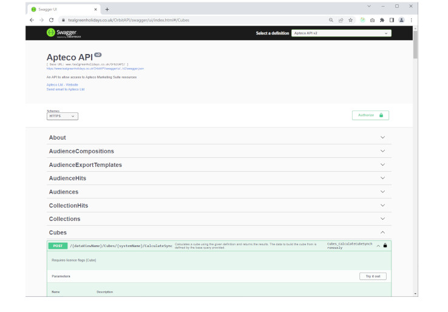
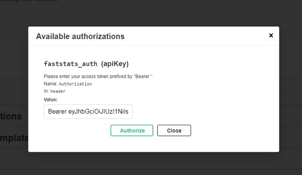

# Connecting to the Teal Green Holidays API



The Teal Green Holidays API provides access to the data needed for this task.  The sample data included in this example ([/data/cube-results.json](../data/cube-results.json)) was generated by calling the `Cubes_CalculateCubeSynchronously` API endpoint (https://www.tealgreenholidays.co.uk/OrbitAPI/swagger/ui/index.html#/Cubes/Cubes_CalculateCubeSynchronously) with the request JSON in [/data/cube-request.json](../data/cube-request.json).

In order to get results live from the Teal Green Holidays API you will need to authenticate and then use the generated JWT Bearer token in the `Authorization` HTTP header.

The process to authenticate with the Teal Green Holidays API and then call the `CalculateCubeSynchronously` endpoint is as follows.  The examples given show the `curl` commands needed, but you can also do this via the Swagger UI (from the above URL) and (hopefully obviously) through your own code.

Although it shouldn't be necessary for this task, if you are interested then this is further documentation and links to other examples at https://github.com/Apteco/AptecoAPIGuides

## CORS

The Teal Green Holidays API has Cross-Origin Resource Sharing (CORS) settings applied so that by default only web applications served from a limited set of domains and ports will be able to access the API.  These include:

- http://localhost:4200
- http://localhost:3000
- http://localhost:8080
- http://localhost
- https://localhost

This should allow easy development of an application, but you may need to contact us if you choose to host an application on a public server that then connects back to the API. 

## Authentication

1. Call the `Sessions_CreateSimpleSession` endpoint.  You will need a DataView name (which for the Teal Green Holidays API is `CloudDemo`), user login and password (which can be provided on request).  The DataView name is passed as part of the URL and the user login and password are passed as form parameters.

```
curl -X 'POST' \
  'https://www.tealgreenholidays.co.uk/OrbitAPI/CloudDemo/Sessions/SimpleLogin' \
  -H 'accept: application/json' \
  -H 'Content-Type: application/x-www-form-urlencoded' \
  -d 'UserLogin=<provided username>&Password=<provided password>'
```

This will return some JSON results including an `accessToken` property which contains the JWT needed for subsequent requests.

If you are using the Swagger UI you can then enter this token by clicking on the "Authorise" button at the top of the page and then entering the value of `Bearer` then a space and then the JWT token:



## Requesting a cube

2. To make a cube request you then simply call the `Cubes_CalculateCubeSynchronously` endpoint with the appropriate `Authorization` header and post the request JSON from [/data/cube-request.json](../data/cube-request.json).  As well as needing to provide a DataView name (of `CloudDemo`) you also need to supply a system name, which in the case of the Teal Green Holidays demo is also `CloudDemo`.  Both of these values are passed as part of the URL.

```
curl -X 'POST' \
  'https://www.tealgreenholidays.co.uk/OrbitAPI/CloudDemo/Cubes/CloudDemo/CalculateSync' \
  -H 'accept: application/json' \
  -H 'Authorization: Bearer <JWT token from step 1>' \
  -H 'Content-Type: application/json' \
  -d '{
  "baseQuery": {
    "selection": {
      "tableName": "People"
    }
  },
  "resolveTableName": "People",
  "storage": "Full",
  "leftJoin": false,
  "dimensions": [
    {
      "id": "dimension-1",
      "type": "Selector",
      "variableName": "boDest"
    },
	{
      "id": "dimension-2",
      "type": "DateBand",
      "variableName": "boDate",
      "banding": {
        "type": "Years"
      }
    }
  ],
  "measures": [
    {
      "id": "measure-1",
      "displayName": "Count",
      "resolveTableName": "People",
      "function": "Count"
    }
  ],
  "subTotals": "All"
}'
```

The data in the request is structured in the following way:

| Property name               | Description                                                                                                                               |
| ---                         | ----                                                                                                                                      |
| baseQuery                   | A query that defines the records being analysed.  Here we are specifying an empty query (i.e. all records) on the `People` table.         |
| resolveTableName            | The name of the table to "resolve" this aggregation (cube) to.                                                                            |
| storage                     | Whether to return a full cube (as an array in the measures[].rows[] property) or a sparse cube (in measures[].cells[]).                   |
| leftJoin                    | Whether to include a category for People that have no bookings - a form of outer join.                                                    |
| dimensions[]                | An array of dimensions to request.                                                                                                        |
| dimensions[].id             | The id of the dimension (user specified and just used to identify it in the results).                                                     |
| dimensions[].type           | The type of a dimension (in our example we use `Selector` for category variables or `DateBand` for groupings/bandings of date variables). |
| dimensions[].variableName   | The reference name of the variable to use - here `boDest` refers to Booking Destination and `boDate` to Booking Date.                     |
| dimensions[].banding.type   | If the dimension is a numeric or date banding, the type of banding to use.  In our example we are banding the Booking Date into `Years`.  |
| measures[]                  | An array of measures to define the values to request.                                                                                     |
| measures[].id               | The id of the measure (user specified and just used to identify it in the results).                                                       |
| measures[].displayName      | A user-readable name for this measure.                                                                                                    |
| measures[].resolveTableName | The name of the entity (table) for this measure.  In this example we are asking for a count of `People`.                                   |
| measures[].function         | The function for this measure, either `Count` or some form of aggregation.                                                                |
| subTotals                   | Whether to return subtotals for each category dimension or not.                                                                           |

If the call is successful it should return results in a similar format to ([/data/cube-results.json](../data/cube-results.json)).  For a description of the format of the results see [/docs/aggregation-result-format.md](./aggregation-result-format.md).

## Advanced - Finding more variables to use as aggregation dimensions

3. It is possible to request a cube with other variables.  You can discover what other variables are available with a call to the `FastStatsSystems_GetFastStatsVariables` endpoint (https://www.tealgreenholidays.co.uk/OrbitAPI/swagger/ui/index.html#/FastStatsSystems/FastStatsSystems_GetFastStatsVariables).  You can also specify a count query string parameter to return more than the default first 10 results, and a filter to return just `Selector` variables.  For example: 

```
curl -X 'GET' \
  'https://www.tealgreenholidays.co.uk/OrbitAPI/CloudDemo/FastStatsSystems/CloudDemo/Variables?filter=Type%3D%22Selector%22&count=100' \
  -H 'accept: application/json' \
  -H 'Authorization: Bearer <JWT token from step 1>'
```